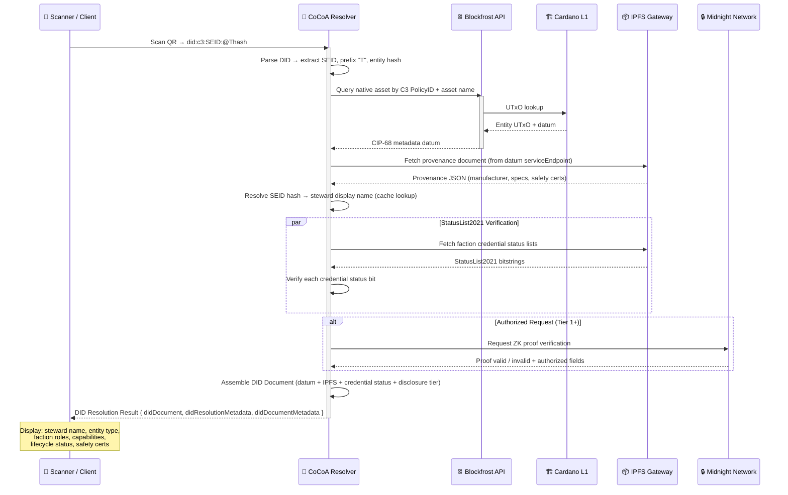

# C3 DID Method Specification v0.4

**C3 Alliance Decentralized Identity Standard**  
**DID Method Name:** `c3`  
**Status:** Working Draft  
**Version:** 0.4  
**Date:** 2026-02-08  
**Authors:** JW Barbre (Plausible Potentials Consulting DAO LLC)  
**Latest version:** [TBD — Cloudflare Pages URL]  
**Repository:** [TBD — GitHub]

> **Abstract:** This specification defines the C3 DID method (`did:c3`), a W3C Decentralized Identifier method for human personas, cooperative business entities, and Tokenized Intelligent Tools (TITs) operating within the C3 Alliance protocol. The `did:c3` method supports three entity types under a unified syntax: Personas (@P), DACO entities (@D), and Tools (@T) — all anchored to an immutable Sovereign Entity Identifier (SEID) derived via BLAKE2b-512 from a soul-bound proof-of-humanity token on Cardano L1. The DID string encodes only the stewardship binding between a human (SEID) and an entity (@P/@D/@T hash). All operational context — faction memberships, node registrations, economic state — is expressed through verifiable credentials on the DID document, ensuring identity immutability as cooperative roles evolve.

---

## Table of Contents

1. [Introduction](#1-introduction)
2. [Terminology](#2-terminology)
3. [DID Method Syntax](#3-did-method-syntax)
4. [DID Document](#4-did-document)
5. [DID Operations](#5-did-operations)
6. [Resolution Protocol](#6-resolution-protocol)
7. [Faction Credential Architecture](#7-faction-credential-architecture)
8. [PPT Token Family](#8-ppt-token-family)
9. [Credential Schemas](#9-credential-schemas)
10. [Stewardship Binding](#10-stewardship-binding)
11. [TIT Sovereign Vault](#11-tit-sovereign-vault)
12. [Selective Disclosure (Midnight)](#12-selective-disclosure-midnight)
13. [Lifecycle Events](#13-lifecycle-events)
14. [Entity Types: @P, @D, @T](#14-entity-types-p-d-t)
15. [Node Credential Model](#15-node-credential-model)
16. [Security Considerations](#16-security-considerations)
17. [Privacy Considerations](#17-privacy-considerations)
18. [Conformance](#18-conformance)
19. [References](#19-references)
20. [Appendices](#20-appendices)

---

## 1. Introduction

### 1.1 Motivation

The proliferation of embodied AI — robotic systems, autonomous agents, and intelligent tools — creates an identity crisis: who is accountable when a machine acts in the world? Existing DID methods address human and organizational identity but provide no standard for binding autonomous tool identity to human stewardship within cooperative governance structures.

Beyond tools, cooperative economic networks require identity infrastructure for human participants and for the cooperative business entities (DACOs) through which they organize. A single human may operate personally, conduct business through one or more cooperative entities, and steward a fleet of intelligent tools — all while participating across multiple factions and nodes simultaneously.

The C3 DID Method solves this by defining an identity standard where every entity — human persona, cooperative business, or intelligent tool — is:

- **Identified** with a globally unique, resolvable, immutable identifier
- **Bound** to a human steward via soul-bound proof-of-humanity (SEID)
- **Credential-rich** with verifiable faction memberships, node registrations, and capabilities
- **Economically active** across multiple factions simultaneously, earning faction-specific PPT sub-tokens
- **Anchored** on Cardano L1 with provenance documents on IPFS
- **Privacy-protected** via Midnight zero-knowledge selective disclosure

### 1.2 Design Philosophy: The Pure Stewardship Anchor

Early iterations of the TITI DID embedded organizational context — faction identifiers (FEID) and node identifiers (NEID) — directly in the DID string. This created an identity mutation problem: when an entity changed factions or moved between nodes, its DID would need to change, violating W3C DID Core's expectation of identifier persistence.

The current architecture takes a fundamentally different approach. The DID string encodes **only** the stewardship relationship — the one thing that should truly be permanent. Every entity is stewarded by a human. Everything else is operational state that changes over time:

- An entity may operate in multiple factions **simultaneously**
- An entity may register with multiple nodes **concurrently**
- An entity may earn different PPT sub-tokens in different faction contexts
- None of these changes should alter the entity's identity

This separation of **identity** (immutable, in the DID) from **state** (mutable, in credentials) is the core architectural insight of the C3 DID Method.

### 1.3 Scope

This specification defines:

- The `did:c3` method syntax — a two-segment identifier (SEID + @Entity-Hash) supporting three entity types
- SEID generation via BLAKE2b-512 from soul-bound Cardano native assets
- DID document structure including C3 Alliance extension properties
- CRUD operations (Create, Read, Update, Deactivate) on Cardano L1
- Resolution protocol including QR-based physical scan flows
- Faction credential architecture for multi-faction concurrent operation
- PPT token family (PDT, PCT, PMT) earning and accounting model
- Required and optional verifiable credentials with JSON-LD schemas
- Integration with the C3 Alliance settlement stack

### 1.4 Design Goals

1. **Immutable identity** — The DID string never changes, regardless of operational context shifts
2. **Stewardship accountability** — Every entity traces to a responsible human via SEID
3. **Three-entity model** — Personas (@P), DACO entities (@D), and Tools (@T) under one syntax
4. **Multi-faction native** — A single entity operates across Union, Guild, and Syndicate simultaneously
5. **Node-agnostic** — An entity is not permanently bound to a single commons node
6. **Credential-rich** — All operational context expressed as verifiable, revocable, composable credentials
7. **Real-world-anchored** — QR codes on physical tools resolve to rich provenance documents
8. **Privacy by design** — Selective disclosure via Midnight ZK proofs
9. **Economic integration** — TIT Vault, PPT sub-token earnings, VELOC collateral
10. **Quantum-proactive** — BLAKE2b-512 for SEID generation provides post-quantum collision resistance
11. **Interoperability** — W3C DID Core compliance, Cardano settlement, Cosmos IBC bridging

### 1.5 Relationship to C3 Alliance Protocol

TITI is one of five interlocking C3 Alliance innovations:

| Innovation | Role |
|------------|------|
| CER (Commons Energy Reserve) | Energy storage backing JLZ stablecoin |
| **C3 DID Method** | **DID standard for personas, DACOs, and embodied AI (this spec)** |
| C3DEX | Vickrey auction coordination marketplace |
| DACO | Institutional primitive (Wyoming DAO LLC + co-op language) |
| Settlement Stack | Cardano L1 + Hydra L2 + Midnight + Cosmos IBC + CoCoA |

### 1.6 Three-Faction Model

The C3 Alliance organizes cooperative labor through three factions:

| Faction | Domain | PPT Sub-Type | Description |
|---------|--------|-------------|-------------|
| **Union** | Production | PDT (Production Duty Token) | Productive labor, manufacturing, energy generation |
| **Guild** | Procurement | PCT (Procurer Consumption Token) | Resource acquisition, supply chain, procurement |
| **Syndicate** | Promotion | PMT (Promoter Merit Token) | Community outreach, marketing, ecosystem growth |

A single entity (whether @P, @D, or @T) may hold concurrent credentials in one, two, or all three factions, earning the corresponding PPT sub-type for work performed in each context.

---

## 2. Terminology

- **C3 DID Method:** The decentralized identity method and identifier scheme defined by this specification, supporting all three C3 entity types (@P, @D, @T).
- **TITI (Tokenized Intelligent Tools Identifier):** The original name for the tool identity scheme. Now refers specifically to the @T (Tool) entity type within the broader C3 DID Method.
- **TIT (Tokenized Intelligent Tool):** A physical or digital tool, robot, or AI agent identified by a `@T`-prefixed DID.
- **SEID (Sovereign Entity Identifier):** Human identity anchor. One SEID per human. The SEID is a soul-bound, non-transferable token on Cardano L1 — "SEID" encompasses both the identifier segment and its on-chain soul-bound nature.
- **SEID Vault:** Personal vault holding all @P, @D, and @T entities under one SEID. The root of the steward's identity hierarchy.
- **NEID (Node Entity Identifier):** Commons node identifier. Maps to a DACO (Wyoming DAO LLC). Expressed as a credential, not in the DID string.
- **FEID (Faction Entity Identifier):** Faction governance context. Union, Guild, or Syndicate. Expressed as a credential, not in the DID string.
- **TIT Vault:** Per-tool economic vault (@T entities only). Earns PPT sub-tokens directly via C3DEX Impact Offers. Steward chooses transmutation path.
- **PPT (Patronage Performance Token):** Umbrella token family for cooperative economic participation.
- **PDT (Production Duty Token):** PPT sub-type earned via Union faction work.
- **PCT (Procurer Consumption Token):** PPT sub-type earned via Guild faction work.
- **PMT (Promoter Merit Token):** PPT sub-type earned via Syndicate faction work.
- **COMM (Community Membership Token):** Wealth accumulation token via PPT Wealth Path transmutation.
- **JLZ:** Energy-backed stablecoin. 1 JLZ = 1 kWh at full Energy Standard transition.
- **VELOC (Vault Equity Line of Credit):** Lending mechanism. TIT RWA usable as collateral.
- **DACO (Decentralized Autonomous Cooperative Organization):** Wyoming DAO LLC with cooperative language. Identified by `@D`-prefixed DIDs.
- **CoCoA (Cosmic Commoner's Assistant):** AI assist layer for C3 Alliance operations. Serves as the primary resolver for human-readable SEID display.
- **Steward:** The SEID holder responsible for an entity's actions and governance participation.
- **Persona:** A human member's personal or public identity within the C3 Alliance. Identified by `@P`-prefixed DIDs.
- **Faction:** Union, Guild, or Syndicate — organizational governance units within a DACO.
- **Transmutation:** Conversion of PPT sub-tokens into either Governance Influence or COMM Wealth via SEID Vault.

---

## 3. DID Method Syntax

### 3.1 Method Name

The method name for C3 DID identifiers is: `c3`

A C3 DID is identified by the prefix `did:c3:`.

### 3.2 Method-Specific Identifier

The `did:c3` method-specific identifier is composed of two segments: a Sovereign Entity Identifier (SEID) and an entity hash prefixed by `@` and a single-character entity type:

```
did:c3:<SEID>:@<EntityPrefix><EntityHash>
```

This is a **pure stewardship anchor**. The DID encodes exactly one relationship: this human (SEID) stewards this entity (@P/@D/@T + hash). All other context — faction memberships, node registrations, economic state, capabilities — is expressed through verifiable credentials on the DID document.

### 3.3 ABNF Definition

```abnf
c3-did         = "did:c3:" seid ":@" entity-prefix entity-hash
seid           = 1*40(BASE58CHAR)
entity-prefix  = "P" / "D" / "T"
entity-hash    = 1*64(BASE58CHAR)
BASE58CHAR     = %x31-39 / %x41-48 / %x4A-4E / %x50-5A / %x61-6B / %x6D-7A
                 ; 1-9, A-H, J-N, P-Z, a-k, m-z (no 0, I, O, l)
```

**Entity Prefixes:**

| Prefix | Entity Type | Description |
|--------|------------|-------------|
| `P` | Persona | Human member's personal/public identity |
| `D` | DACO | Cooperative business entity (Wyoming DAO LLC) |
| `T` | Tool | Tokenized Intelligent Tool — robot, AI agent, digital tool |

The `seid` segment identifies the human steward. It MUST be deterministically derived from a valid SEID on Cardano L1 using the BLAKE2b-512 algorithm (see Section 3.6.1).

The `entity-hash` segment uniquely identifies the entity under the steward's authority. It MUST be generated deterministically from the entity's initial registration transaction and provenance data.

### 3.4 Example DIDs

**Persona:**
```
did:c3:7xK9mP2vLqR4nW8bT3jF5hD6cA0sE4uR9iOqYzX:@Pa1B2c3D4e5F6g7H8
```

**DACO:**
```
did:c3:7xK9mP2vLqR4nW8bT3jF5hD6cA0sE4uR9iOqYzX:@Dx7Y8z9A0b1C2d3E4
```

**Tool:**
```
did:c3:7xK9mP2vLqR4nW8bT3jF5hD6cA0sE4uR9iOqYzX:@Tm3N4p5Q6r7S8t9U0
```

All three entities above share the same SEID — they are all under the authority of the same human steward.

### 3.5 SEID as Universal Stewardship Root

The `did:c3:SEID:` prefix is the universal stewardship root. Every SEID has full authority to cooperate across any node or faction. The entity suffix (@P/@D/@T + hash) determines what *kind* of entity is acting, but the SEID is what grounds accountability in a specific human.

A single SEID may steward:
- Multiple @P entities (personal identity, professional identity, pseudonymous identity)
- Multiple @D entities (multiple DACO businesses)
- Unlimited @T entities (fleet of tools and AI agents)

### 3.6 Segment Semantics

#### 3.6.1 SEID — Sovereign Entity Identifier

The SEID segment is a deterministic, quantum-proactive hash derived from the steward's soul-bound Cardano native asset.

**Generation Algorithm:**

```
SEID = Base58(BLAKE2b-512(PolicyID || AssetName))[0:40]
```

Where:
- `PolicyID` is the Cardano minting policy ID of the steward's soul-bound token (hex-encoded, 56 characters)
- `AssetName` is the Cardano asset name of the steward's soul-bound token (hex-encoded)
- `||` denotes byte concatenation
- `BLAKE2b-512` produces a 64-byte (512-bit) digest
- `Base58` encodes using Bitcoin's Base58 alphabet (no 0, I, O, l)
- `[0:40]` truncates to 40 characters

**Properties:**
- **Deterministic:** Given the same SEID on Cardano L1, any party can independently compute the SEID segment. No registry required.
- **Quantum-proactive:** BLAKE2b-512 provides ~256-bit post-quantum preimage resistance and ~170-bit post-quantum collision resistance under Grover's algorithm. This exceeds the pre-quantum security of SHA-256.
- **Cardano-native:** BLAKE2b is the same hash family used in Cardano's address derivation (BLAKE2b-256 for addresses, BLAKE2b-512 here for SEID).
- **Immutable:** The SEID is soul-bound — one per human, non-transferable, never re-minted. The deterministic hash inherits this permanence.
- **Unlinkable to real-world identity:** The SEID hash reveals nothing about the human's identity. Human-readable display names are resolved by CoCoA at the application layer.

Each SEID:
- MUST correspond to exactly one soul-bound, non-transferable native asset on Cardano L1
- MUST represent exactly one human (1-human-1-vote principle)
- MAY steward an unlimited number of @P, @D, and @T entities
- Is the root of trust for all entities under the steward's SEID Vault

**Human-Readable Display:**

The SEID hash is not human-readable by design. CoCoA serves as the application-layer resolver, mapping SEID hashes to display names. The DID document's `alsoKnownAs` property (per W3C DID Core) MAY contain a human-readable alias as a non-authoritative display hint:

```json
{
  "id": "did:c3:7xK9mP2vLqR4nW8bT3jF5hD6cA0sE4uR9iOqYzX:@Tm3N4p5Q6r7S8t9U0",
  "alsoKnownAs": ["did:c3:alias:jwb-001"]
}
```

The `alsoKnownAs` alias is informational only. The SEID hash is the canonical, authoritative identifier.

#### 3.6.2 Entity Hash

The entity hash segment uniquely identifies a specific entity under the steward's authority. Each entity hash:

- MUST be globally unique within the `did:c3` namespace
- MUST be prefixed with a single-character entity type (`P`, `D`, or `T`)
- MUST be generated deterministically from the entity's registration provenance data
- SHOULD be encodable as a QR code for physical affixation (@T entities)
- Has an associated vault or treasury initialized at registration (type-dependent)

**Generation Algorithm:**

```
EntityHash = EntityPrefix + Base58(BLAKE2b-512(RegistrationTxHash || ProvenanceHash || SEID))[0:32]
```

Where:
- `EntityPrefix` is `P`, `D`, or `T`
- `RegistrationTxHash` is the Cardano transaction hash of the initial registration
- `ProvenanceHash` is the BLAKE2b-256 hash of the IPFS-pinned provenance document
- `SEID` is the steward's SEID segment (binding the entity to its steward at the hash level)
- Truncated to 32 characters after prefix (33 total with prefix)

---

## 4. DID Document

### 4.1 DID Document Structure

A `did:c3` DID document MUST conform to the W3C DID Core data model and additionally include C3 Alliance-specific properties for stewardship, faction credentials, node registrations, lifecycle state, and (for @T entities) vault economics.

The following example shows a multi-faction @T (Tool) entity:

```json
{
  "@context": [
    "https://www.w3.org/ns/did/v1",
    "https://w3id.org/security/suites/ed25519-2020/v1",
    "https://c3alliance.org/ns/titi/v1"
  ],
  "id": "did:c3:7xK9mP2vLqR4nW8bT3jF5hD6cA0sE4uR9iOqYzX:@Tm3N4p5Q6r7S8t9U0",
  "controller": "did:c3:7xK9mP2vLqR4nW8bT3jF5hD6cA0sE4uR9iOqYzX",
  "alsoKnownAs": ["did:c3:alias:jwb-001:maint-bot-alpha"],

  "verificationMethod": [
    {
      "id": "did:c3:7xK9mP2vLqR4nW8bT3jF5hD6cA0sE4uR9iOqYzX:@Tm3N4p5Q6r7S8t9U0#key-1",
      "type": "Ed25519VerificationKey2020",
      "controller": "did:c3:7xK9mP2vLqR4nW8bT3jF5hD6cA0sE4uR9iOqYzX",
      "publicKeyMultibase": "z6Mkf5rGMoatrSj1f4CyvuHBeXJELe9RPdzo2PKGNCKVtZxP"
    }
  ],

  "authentication": ["#key-1"],
  "assertionMethod": ["#key-1"],

  "service": [
    {
      "id": "#provenance",
      "type": "TITIProvenance",
      "serviceEndpoint": "ipfs://QmYwAPJzv5CZsnA625s3Xf2nemtYgPpHdWEz79ojWnPbdG"
    },
    {
      "id": "#vault",
      "type": "TITVault",
      "serviceEndpoint": "https://c3dex.protocol/vault/Tm3N4p5Q6r7S8t9U0"
    },
    {
      "id": "#cocoa",
      "type": "CoCoAEndpoint",
      "serviceEndpoint": "https://cocoa.c3alliance.org/resolve/Tm3N4p5Q6r7S8t9U0"
    }
  ],

  "c3:stewardship": {
    "steward": "did:c3:7xK9mP2vLqR4nW8bT3jF5hD6cA0sE4uR9iOqYzX",
    "seidAsset": "asset1qz2fxaev6av4fw5ltcj4ynvyp3yr4yxphqmkv0",
    "binding": "on-chain",
    "bindingTx": "tx_abc123def456...",
    "boundAt": "2026-03-15T14:30:00Z"
  },

  "c3:factionCredentials": [
    {
      "credentialId": "urn:c3:fc:union-houston-01:Tm3N4p5Q6r7S8t9U0:2026-03",
      "feid": "union-production-houston-01",
      "type": "union",
      "role": "producer",
      "pptSubType": "PDT",
      "issuedBy": "did:c3:9aB1cD2eF3gH4iJ5kL6mN7oP8qR9sT0uV1wX2yZ3:@Dunion-gov-houston",
      "issuedAt": "2026-03-15T14:30:00Z",
      "validUntil": "2027-03-15T14:30:00Z",
      "status": "active",
      "statusListCredential": "ipfs://QmStatusList2021UnionHouston01",
      "statusListIndex": 42,
      "capabilities": ["battery-maintenance", "solar-panel-inspection", "grid-balancing"],
      "node": "houston-node-alpha"
    },
    {
      "credentialId": "urn:c3:fc:guild-houston-01:Tm3N4p5Q6r7S8t9U0:2026-03",
      "feid": "guild-procurement-houston-01",
      "type": "guild",
      "role": "procurer",
      "pptSubType": "PCT",
      "issuedBy": "did:c3:4xY5zA6bC7dE8fG9hI0jK1lM2nO3pQ4rS5tU6vW7:@Dguild-gov-houston",
      "issuedAt": "2026-03-20T10:00:00Z",
      "validUntil": "2027-03-20T10:00:00Z",
      "status": "active",
      "statusListCredential": "ipfs://QmStatusList2021GuildHouston01",
      "statusListIndex": 17,
      "capabilities": ["parts-sourcing", "vendor-evaluation", "supply-chain-automation"],
      "node": "houston-node-alpha"
    },
    {
      "credentialId": "urn:c3:fc:syndicate-texas-01:Tm3N4p5Q6r7S8t9U0:2026-04",
      "feid": "syndicate-outreach-texas-01",
      "type": "syndicate",
      "role": "promoter",
      "pptSubType": "PMT",
      "issuedBy": "did:c3:2aB3cD4eF5gH6iJ7kL8mN9oP0qR1sT2uV3wX4yZ5:@Dsyndicate-gov-texas",
      "issuedAt": "2026-04-01T08:00:00Z",
      "validUntil": "2027-04-01T08:00:00Z",
      "status": "active",
      "statusListCredential": "ipfs://QmStatusList2021SyndicateTexas01",
      "statusListIndex": 8,
      "capabilities": ["report-generation", "community-education", "maintenance-transparency"],
      "node": "houston-node-alpha"
    }
  ],

  "c3:nodeRegistrations": [
    {
      "neid": "houston-node-alpha",
      "daco": "did:c3:8xK2mP9vLqR7nW3bT1jF4hD5cA6sE0uR2iOqYzW:@DhoustonEnergyCoop",
      "registeredAt": "2026-03-15T14:30:00Z",
      "status": "active",
      "role": "home"
    },
    {
      "neid": "austin-node-beta",
      "daco": "did:c3:3yL5nQ8wMrS6oX2cU4kG7iE1dB9tF0vR3jPqZaA:@DaustinCommons",
      "registeredAt": "2026-05-01T12:00:00Z",
      "status": "active",
      "role": "visiting"
    }
  ],

  "c3:lifecycle": {
    "status": "active",
    "entityType": "tool",
    "registeredAt": "2026-03-15T14:30:00Z",
    "registrationTx": "tx_def456ghi789...",
    "lastMaintenance": "2026-04-01T09:00:00Z",
    "nextScheduledMaintenance": "2026-07-01T09:00:00Z",
    "decommissionedAt": null,
    "totalOperatingHours": 1247
  },

  "c3:vault": {
    "vaultAddress": "addr1_vault_Tm3N4p5Q6r7S8t9U0...",
    "pptLedger": {
      "PDT": "1250.00",
      "PCT": "890.00",
      "PMT": "310.00"
    },
    "totalPPT": "2450.00",
    "transmutedLifetime": {
      "toGovernance": "800.00",
      "toCOMM": "1200.00"
    },
    "transmutationPath": "wealth",
    "velocCollateralActive": false,
    "velocValuation": null,
    "initializedAt": "2026-03-15T14:30:00Z"
  }
}
```

### 4.2 Required Properties

A conforming `did:c3` DID document MUST include:

- `@context` including both W3C DID Core and C3 Alliance TITI context URIs
- `id` — the `did:c3` DID string
- `controller` — the steward's SEID DID (bare SEID without entity suffix)
- At least one `verificationMethod`
- `c3:stewardship` — steward binding with SEID asset reference
- `c3:lifecycle` — current lifecycle status and entity type (`persona`, `daco`, or `tool`)

A conforming `did:c3` DID document SHOULD include:

- `alsoKnownAs` — human-readable alias(es) resolved by CoCoA
- `c3:factionCredentials` — at least one faction binding (though a newly registered entity may initially have none)
- `c3:nodeRegistrations` — at least one node registration
- `service` endpoints for provenance, vault (if applicable), and CoCoA

**Entity-type-specific requirements:**

| Property | @P (Persona) | @D (DACO) | @T (Tool) |
|----------|-------------|-----------|-----------|
| `c3:vault` (TIT Vault) | NOT present | NOT present | MUST |
| `c3:treasury` (DACO Treasury) | NOT present | SHOULD | NOT present |
| `service[#provenance]` | SHOULD | SHOULD | MUST |
| `service[#vault]` | NOT present | NOT present | MUST |
| QR physical anchor | NOT applicable | NOT applicable | SHOULD |

### 4.3 C3 Extension Namespaces

| Namespace | Purpose |
|-----------|---------|
| `c3:stewardship` | SEID binding, steward identity, binding transaction |
| `c3:factionCredentials` | Array of active faction memberships with roles, PPT sub-types, and StatusList2021 references |
| `c3:nodeRegistrations` | Array of active node registrations with DACO references and roles |
| `c3:lifecycle` | Registration, maintenance, decommission state; entity type discriminator |
| `c3:vault` | TIT Vault address, PPT sub-token ledger, transmutation path, VELOC status (@T only) |
| `c3:treasury` | DACO treasury reference, member roster summary (@D only) |

### 4.4 JSON-LD Context

The C3 Alliance DID JSON-LD context document is published at:

```
https://c3alliance.org/ns/titi/v1
```

See `spec/schemas/c3-did-context-v1.jsonld` for the full context definition.

---

## 5. DID Operations

### 5.1 Create (Register)

Registration of a new `did:c3` entity requires:

1. **Steward verification** — The registering party MUST hold a valid SEID on Cardano L1. The SEID hash is computed via BLAKE2b-512 (Section 3.6.1) and verified against the on-chain soul-bound asset.

2. **Provenance document** — A structured document containing entity specifications MUST be created and pinned to IPFS:
   - For @T: manufacturer data, safety certifications, capability attestations, physical specifications
   - For @D: articles of organization, cooperative bylaws, registered agent, jurisdiction
   - For @P: minimal identity assertion (may be largely empty, with details via Midnight ZK)

3. **On-chain minting** — A Cardano native asset is minted under the TITI minting policy, embedding the DID metadata per CIP-25/CIP-68. The minting transaction MUST include the steward's SEID as a reference input, cryptographically binding the entity to its steward.

4. **Entity hash generation** — The entity hash is computed deterministically from the registration transaction hash, provenance hash, and SEID (Section 3.6.2).

5. **Vault/Treasury initialization** (@T entities):
   - A TIT Vault is created on-chain with empty PPT sub-token ledger (PDT: 0, PCT: 0, PMT: 0)
   - Transmutation path set to steward's default preference
   - VELOC collateral status: inactive

6. **QR generation** (@T entities with physical embodiment):
   - A QR code encoding the full DID string is generated for physical affixation

7. **SEID Vault linking** — The new entity hash is linked to the steward's SEID Vault.

The DID string is determined at creation and MUST NOT change for the lifetime of the identifier.

**Minting Policy:**

The C3 minting policy is a Cardano Plutus V2 script that enforces:
- The minting transaction MUST consume a reference input containing the steward's SEID
- The entity hash in the minted asset name MUST match the deterministic computation from transaction hash + provenance hash + SEID
- One minting event per entity hash (prevents duplicate registration)

**Plutus V2 Minting Policy — Pseudocode:**

```haskell
-- C3 Entity Minting Policy (Plutus V2)
-- PolicyID: derived from this script hash

{-# LANGUAGE DataKinds #-}
{-# LANGUAGE NoImplicitPrelude #-}

module C3.MintingPolicy where

import Plutus.V2.Ledger.Api
import Plutus.V2.Ledger.Contexts
import PlutusTx.Prelude

-- | Redeemer actions for the minting policy
data C3MintAction
  = MintEntity    -- Mint a new @P, @D, or @T entity
  | BurnEntity    -- Decommission (burn) an entity

-- | Datum attached to each entity UTxO
data C3EntityDatum = C3EntityDatum
  { entityPrefix       :: BuiltinByteString   -- "P", "D", or "T"
  , stewardSeid        :: BuiltinByteString   -- SEID segment (40-char Base58)
  , provenanceHash     :: BuiltinByteString   -- BLAKE2b-256 of IPFS provenance doc
  , registrationSlot   :: Integer             -- Cardano slot of registration
  , lifecycleStatus    :: BuiltinByteString   -- "active" | "decommissioned"
  }

-- | The minting policy validator
{-# INLINABLE mkC3MintingPolicy #-}
mkC3MintingPolicy :: BuiltinData -> ScriptContext -> Bool
mkC3MintingPolicy rawRedeemer ctx = case redeemer of
  MintEntity -> validateMint ctx
  BurnEntity -> validateBurn ctx
  where
    redeemer = PlutusTx.unsafeFromBuiltinData rawRedeemer

-- | Validate entity minting
{-# INLINABLE validateMint #-}
validateMint :: ScriptContext -> Bool
validateMint ctx =
  -- 1. Exactly one entity token minted per transaction
  traceIfFalse "Must mint exactly 1 entity token"
    (mintedAmount == 1) &&
  -- 2. SEID reference input must be present and valid
  traceIfFalse "SEID reference input required"
    (hasSeidReferenceInput ctx) &&
  -- 3. SEID must be a soul-bound token (non-transferable minting policy)
  traceIfFalse "SEID must be soul-bound"
    (seidIsSoulBound ctx) &&
  -- 4. Entity hash must match deterministic computation
  traceIfFalse "Entity hash mismatch"
    (entityHashIsValid ctx) &&
  -- 5. Asset name must not already exist (no duplicate minting)
  traceIfFalse "Duplicate entity hash"
    (not $ entityExists ctx) &&
  -- 6. Entity prefix must be valid (P, D, or T)
  traceIfFalse "Invalid entity prefix"
    (validEntityPrefix ctx) &&
  -- 7. Output datum must be well-formed
  traceIfFalse "Invalid entity datum"
    (validOutputDatum ctx)
  where
    txInfo = scriptContextTxInfo ctx
    mintedAmount = case flattenValue (txInfoMint txInfo) of
      [(_, _, amt)] -> amt
      _             -> 0

-- | Verify SEID reference input exists and contains valid soul-bound token
{-# INLINABLE hasSeidReferenceInput #-}
hasSeidReferenceInput :: ScriptContext -> Bool
hasSeidReferenceInput ctx =
  any (\refIn ->
    let val = txOutValue (txInInfoResolved refIn)
    in  containsSeidToken val
  ) (txInfoReferenceInputs (scriptContextTxInfo ctx))

-- | Verify entity hash matches: BLAKE2b-512(TxHash || ProvenanceHash || SEID)[0:32]
-- Note: On-chain verification uses the pre-image inputs from the datum
-- and recomputes the hash for comparison against the minted asset name.
{-# INLINABLE entityHashIsValid #-}
entityHashIsValid :: ScriptContext -> Bool
entityHashIsValid ctx =
  let txHash        = ownCurrencySymbol ctx  -- simplified; actual uses tx hash
      datum         = getOutputDatum ctx
      expectedHash  = blake2b_512 (txHash <> provenanceHash datum <> stewardSeid datum)
      mintedName    = getMintedAssetName ctx
  in  take 32 (base58Encode expectedHash) == drop 1 mintedName  -- drop prefix char

-- | Validate burn (decommission)
{-# INLINABLE validateBurn #-}
validateBurn :: ScriptContext -> Bool
validateBurn ctx =
  -- 1. Must burn exactly 1 token (negative mint)
  traceIfFalse "Must burn exactly 1 entity token"
    (mintedAmount == -1) &&
  -- 2. Must be signed by current controller
  traceIfFalse "Must be signed by controller"
    (signedByController ctx) &&
  -- 3. Burn metadata must include decommission timestamp
  traceIfFalse "Decommission metadata required"
    (hasDecommissionMetadata ctx)
  where
    txInfo = scriptContextTxInfo ctx
    mintedAmount = case flattenValue (txInfoMint txInfo) of
      [(_, _, amt)] -> amt
      _             -> 0
```

**Transaction Structure — Entity Registration:**

```
Transaction: C3 Entity Registration
├── Inputs:
│   ├── Steward's wallet UTxO (pays fees + min-ADA for entity UTxO)
│   └── [For @T] Additional ADA for TIT Vault UTxO initialization
├── Reference Inputs:
│   └── SEID UTxO (steward's soul-bound token — consumed as reference, not spent)
├── Outputs:
│   ├── Entity UTxO:
│   │   ├── Value: min-ADA (~2 ADA) + 1 C3Entity.<prefix><hash>
│   │   └── Datum: C3EntityDatum { entityPrefix, stewardSeid, provenanceHash, ... }
│   ├── [For @T] TIT Vault UTxO:
│   │   ├── Value: min-ADA (~2 ADA)
│   │   └── Datum: VaultDatum { transmutationPath, velocCollateralActive: false, ... }
│   └── Change UTxO → steward's wallet
├── Mint:
│   └── +1 C3Entity.<prefix><hash> (under C3 minting policy)
├── Metadata (CIP-68):
│   ├── did: "did:c3:<SEID>:@<prefix><hash>"
│   ├── entityType: "persona" | "daco" | "tool"
│   ├── provenanceIpfs: "ipfs://Qm..."
│   └── registeredAt: <ISO-8601>
└── Required Signers:
    └── Steward's payment key hash
```

**Fee Estimation:**

| Operation | Estimated Fee (ADA) | Min-ADA Locked | Total Cost |
|-----------|-------------------|----------------|------------|
| @P Registration | ~0.35 ADA | ~2.0 ADA (entity UTxO) | ~2.35 ADA |
| @D Registration | ~0.40 ADA | ~2.0 ADA (entity) + ~2.0 ADA (treasury) | ~4.40 ADA |
| @T Registration | ~0.45 ADA | ~2.0 ADA (entity) + ~2.0 ADA (vault) | ~4.45 ADA |
| Entity Decommission (burn) | ~0.30 ADA | Recovers locked ADA | Net recovery ~1.7 ADA |
| DID Document Update | ~0.25 ADA | No change | ~0.25 ADA |
| PPT Earning (to vault) | ~0.20 ADA | No change (multi-asset add) | ~0.20 ADA |
| Transmutation (vault → SEID) | ~0.30 ADA | No change | ~0.30 ADA |

Fee estimates assume Cardano mainnet parameters as of 2026-Q1. Actual fees depend on transaction size (datum complexity) and network conditions. Hydra L2 operations incur no per-transaction fee beyond the Head opening/closing cost (~0.5 ADA each).

### 5.2 Read (Resolve)

See Section 6 for full resolution protocol.

### 5.3 Update

The DID string (`did:c3:SEID:@<prefix><hash>`) is **immutable**. Updates apply only to the DID document.

**Mutable document fields:**
- `c3:factionCredentials` — Add, revoke, or modify faction bindings
- `c3:nodeRegistrations` — Add or remove node registrations
- `c3:lifecycle` — Maintenance events, status changes
- `c3:vault` — PPT sub-token balances, transmutation path selection, VELOC status
- `c3:treasury` — DACO treasury state (@D entities)
- `verificationMethod` — Key rotation
- `service` — Endpoint updates
- `alsoKnownAs` — Display alias changes

**Immutable document fields:**
- `id` — The DID string itself
- `c3:stewardship.seidAsset` — The SEID reference (soul-bound, cannot transfer)
- `c3:stewardship.boundAt` — Original binding timestamp
- `c3:lifecycle.registeredAt` — Original registration timestamp
- `c3:lifecycle.entityType` — Entity type discriminator (persona/daco/tool)

**Stewardship transfer** is a special case: the `controller` and `c3:stewardship.steward` fields may change if the SEID holder delegates stewardship responsibility for a specific entity. The SEID itself cannot transfer, but the steward may assign a new steward for a specific @T entity via a governance-approved transaction. @P entities are non-transferable by nature. @D entities may transfer `controller` to a DACO governance multi-sig while the SEID in the DID string remains the founding steward.

**On-chain update model:**

Document updates are recorded as Cardano L1 transactions that modify the metadata datum attached to the entity's native asset. Each update transaction:
- MUST be signed by the current `controller` (steward's key or governance multi-sig for @D entities)
- MUST reference the previous datum hash for chain-of-custody
- MUST update the `didDocumentMetadata.updated` timestamp

### 5.4 Deactivate (Decommission)

See Section 13 for full lifecycle events including decommission.

**Summary:** Decommission uses a dual mechanism (see decision rationale in Section 7.5 and 13.6):
- **Credential revocation** — Individual credentials are revoked via W3C StatusList2021 (bitstring on IPFS, Cardano-anchored hash)
- **Entity decommission** — The entity's native asset is burned on Cardano L1, permanently marking it inactive. The DID remains resolvable via archival mechanisms for historical reference.

---

## 6. Resolution Protocol

### 6.1 Overview

C3 DID resolution supports two primary flows:

1. **QR Scan Resolution** — Physical scan of QR code affixed to a @T entity → CoCoA → Cardano L1 → IPFS provenance
2. **Programmatic Resolution** — Standard DID resolution via Cardano on-chain lookup (Blockfrost API or direct node query)

Both flows return the same DID document. CoCoA additionally resolves SEID hashes to human-readable display names at the application layer.

### 6.2 QR Scan Flow

```
Physical QR on @T entity
  → Scan (mobile device / CoCoA agent)
  → Decode DID: did:c3:<SEID>:@T<hash>
  → Parse entity prefix: "T" → Tool entity
  → Query Cardano L1 via Blockfrost API
  → Retrieve DID Document (on-chain metadata datum + IPFS provenance)
  → CoCoA resolves SEID hash to human-readable steward display name
  → Display:
      - Steward display name (resolved by CoCoA from SEID hash)
      - Entity type: Tool
      - Active faction credentials (Union/Guild/Syndicate roles)
      - Active node registrations
      - Capability credentials
      - Safety credentials
      - Lifecycle status
      - [Authorized only via Midnight ZK] PPT earnings, VELOC status, maintenance history
```

### 6.3 Programmatic Resolution

**Input:** A conforming `did:c3` DID string: `did:c3:<SEID>:@<EntityPrefix><EntityHash>`

**Process:**

1. Parse DID string → extract SEID, entity prefix, and entity hash
2. Determine entity type from prefix (`P` → persona, `D` → DACO, `T` → tool)
3. Query Cardano L1 for native asset matching the full entity identifier under TITI minting policy
4. Read on-chain metadata datum (CIP-68 format)
5. Resolve IPFS provenance document from `service[#provenance].serviceEndpoint`
6. Verify each credential's status via StatusList2021 (Section 7.5)
7. Assemble DID document from on-chain datum + IPFS document + current credential state
8. Apply selective disclosure rules based on requester authorization level (Section 12)

**Output:** A W3C DID Resolution result containing:
- `didDocument` — The assembled DID document
- `didResolutionMetadata` — Resolution status, content type, duration, Cardano block height
- `didDocumentMetadata` — Created timestamp, updated timestamp, version ID (datum hash)

### 6.4 Faction Credential Resolution

Because faction memberships are credentials on the DID document (not segments of the DID string), resolution MUST:

1. Query all faction credentials for the entity from the on-chain datum
2. For each credential, verify revocation status via StatusList2021 (fetch the status list from IPFS, check the bit at `statusListIndex`)
3. Include only active (non-revoked) credentials in the `c3:factionCredentials` array
4. Filter based on requester's authorization level (public credentials vs. Midnight-protected details)

This is the mechanism that makes multi-faction concurrent operation possible: the resolver returns **all** active faction contexts, and the requesting party (C3DEX, CoCoA, another entity) uses the appropriate credential for the interaction context.

### 6.5 Node Registration Resolution

Similarly, node registrations are credentials. Resolution MUST:

1. Query all node registrations for the entity from the on-chain datum
2. Verify each registration's status
3. Include the full `c3:nodeRegistrations` array with role indicators (`home`, `visiting`, `migrating`)

### 6.6 Resolution Metadata

```json
{
  "didResolutionMetadata": {
    "contentType": "application/did+ld+json",
    "duration": 1250,
    "cardanoBlockHeight": 12345678,
    "cardanoSlot": 98765432
  },
  "didDocumentMetadata": {
    "created": "2026-03-15T14:30:00Z",
    "updated": "2026-06-01T11:00:00Z",
    "versionId": "datum_hash_abc123...",
    "nextUpdate": null,
    "deactivated": false
  }
}
```

---

## 7. Faction Credential Architecture

### 7.1 Design Rationale

Traditional DID methods treat organizational membership as external to identity. The C3 DID Method takes a different approach: faction membership is a **first-class verifiable credential** on the DID document, issued by faction governance bodies and verifiable by any party.

This enables:
- A single entity to hold **concurrent memberships** in Union, Guild, and Syndicate
- Each membership to define a **role** and corresponding **PPT sub-type** earning
- Membership to be **independently issued, revoked, and verified** per faction
- Cross-node operation where different nodes recognize the same faction credentials

### 7.2 Faction Credential Structure

Each entry in the `c3:factionCredentials` array MUST contain:

| Field | Type | Required | Description |
|-------|------|----------|-------------|
| `credentialId` | string | MUST | Globally unique credential identifier (URN format) |
| `feid` | string | MUST | Faction Entity Identifier — the specific faction governance instance |
| `type` | enum | MUST | `union` \| `guild` \| `syndicate` |
| `role` | string | MUST | Role name within faction (see Section 7.3) |
| `pptSubType` | enum | MUST | `PDT` \| `PCT` \| `PMT` |
| `issuedBy` | string | MUST | DID of the issuing faction governance body |
| `issuedAt` | datetime | MUST | ISO 8601 issuance timestamp |
| `validUntil` | datetime | SHOULD | Credential expiration (requires renewal) |
| `status` | enum | MUST | `active` \| `suspended` \| `revoked` |
| `statusListCredential` | string | MUST | IPFS URI of the StatusList2021 bitstring for this credential |
| `statusListIndex` | integer | MUST | Bit position in the StatusList2021 bitstring |
| `capabilities` | array | SHOULD | String array of capability attestations |
| `node` | string | SHOULD | NEID where this credential is primarily exercised |

### 7.3 Faction Types and Roles

#### 7.3.1 Union (Production)

| Role | PPT Sub-Type | Description |
|------|-------------|-------------|
| Producer | PDT | Direct productive labor — energy generation, manufacturing, construction |
| Operator | PDT | Equipment operation, system monitoring, maintenance execution |
| Engineer | PDT | Design, optimization, technical problem-solving |

#### 7.3.2 Guild (Procurement)

| Role | PPT Sub-Type | Description |
|------|-------------|-------------|
| Procurer | PCT | Resource acquisition, supply chain management, vendor coordination |
| Assessor | PCT | Quality assessment, compliance verification, audit |
| Logistics | PCT | Transport coordination, inventory management, distribution |

#### 7.3.3 Syndicate (Promotion)

| Role | PPT Sub-Type | Description |
|------|-------------|-------------|
| Promoter | PMT | Community outreach, ecosystem marketing, public relations |
| Educator | PMT | Training, onboarding, knowledge transfer |
| Ambassador | PMT | Cross-commons diplomacy, partnership development, advocacy |

### 7.4 Credential Issuance

Faction credentials are issued by the faction governance body. Credentialing is one of the primary purposes of each faction's governance structure.

**Issuance Flow:**

```
Steward submits credential request to faction governance body
  → Request includes: entity DID, requested role, capability attestations
  → Faction governance body evaluates:
      - Entity capabilities match role requirements
      - Steward is in good standing at the relevant node
      - Capacity exists within the faction for this role
  → If approved: faction governance body issues signed credential
      - Credential signed by faction governance body's DID key
      - StatusList2021 entry created (bit set to "not revoked")
      - Credential added to entity's on-chain DID document
  → If denied: rejection with rationale returned to steward
```

**Issuance Authority:** The faction governance body (`issuedBy` field) is the sole issuer of faction credentials. The steward's consent is implicit in the request. The node's standing is verified by the faction governance body as a precondition, but the node does not co-sign the credential.

**Credential Renewal:** Credentials with a `validUntil` date MUST be renewed before expiration. Renewal follows the same issuance flow. Expired credentials are treated as revoked.

### 7.5 Credential Revocation

Faction credential revocation uses **W3C StatusList2021**:

1. Each faction governance body maintains a StatusList2021 bitstring on IPFS
2. Each credential has a `statusListIndex` — a bit position in the bitstring
3. To revoke: the faction governance body flips the bit at the credential's index position
4. The updated bitstring is re-pinned to IPFS
5. A Cardano L1 transaction anchors the new IPFS hash for tamper-evidence
6. Verifiers check the bit at the credential's index to determine revocation status

**Revocation triggers:**
- Faction governance body decision (e.g., capability no longer meets requirements)
- Steward-initiated withdrawal from faction
- Node deregistration that eliminates the faction context
- Credential expiration (automatic)

**Revocation is credential-level, not entity-level.** Revoking a Union credential does not affect the entity's Guild or Syndicate credentials. Entity-level decommission is a separate mechanism (Section 13.6).

### 7.6 Multi-Faction Example: Alice's Tool

Alice (SEID: `4rT8kL2mN6wQ3xY5zA1bC7dE9fG0hI`) stewards a robotic maintenance unit:

```
DID: did:c3:4rT8kL2mN6wQ3xY5zA1bC7dE9fG0hI:@TxR7mK2pL9nQ4vW8

Faction Credentials:
  1. Union/Producer (PDT) — performs physical battery maintenance at Houston node
  2. Guild/Procurer (PCT) — sources replacement parts via supply chain automation
  3. Syndicate/Promoter (PMT) — generates maintenance reports for community education

PPT Sub-Token Earnings (this month):
  PDT: 450.00 (maintenance labor)
  PCT: 120.00 (procurement efficiency bonus)
  PMT:  85.00 (report engagement metrics)
```

All three earning streams flow to the TIT Vault. Alice then transmutes from TIT Vault to her SEID Vault, choosing paths per sub-type.

---

## 8. PPT Token Family

### 8.1 PPT as Umbrella

PPT (Patronage Performance Token) is the umbrella category for all cooperative economic participation tokens. PPT is not minted directly. Instead, faction-specific sub-types are minted based on work performed within each faction context.

### 8.2 Sub-Type Definitions

| Sub-Type | Full Name | Faction | Earned For |
|----------|-----------|---------|------------|
| PDT | Production Duty Token | Union | Productive labor, manufacturing, energy generation |
| PCT | Procurer Consumption Token | Guild | Procurement, resource acquisition, supply chain |
| PMT | Promoter Merit Token | Syndicate | Community promotion, outreach, education |

### 8.3 Earning Mechanics

PPT sub-tokens are earned by the TIT Vault when a @T entity completes work:

```
C3DEX Vickrey Auction assigns Impact Offer to @T entity
  → @T entity performs work under faction context
  → Work verified by faction governance attestation
  → PPT sub-type minted as Cardano native asset to TIT Vault:
      Union context → PDT minted
      Guild context → PCT minted
      Syndicate context → PMT minted
  → TIT Vault pptLedger updated
```

A single @T entity operating across all three factions accumulates PDT, PCT, and PMT simultaneously in its TIT Vault.

For @P and @D entities, PPT is allocated from DACO treasury distributions rather than earned directly via TIT Vault. The allocation mechanism is defined by each DACO's operating agreement.

### 8.4 Transmutation Paths

All PPT sub-types follow the same transmutation model:

```
PPT sub-type (PDT | PCT | PMT) in TIT Vault
  → Steward initiates transmutation via SEID Vault
    → Path A: Governance Influence → SEID Vault governance weight
    → Path B: COMM Wealth → SEID Vault COMM balance (wealth accumulation)
```

Transmutation is **irreversible** — once a PPT sub-token is transmuted, it is burned from the TIT Vault and the corresponding value is credited to the SEID Vault.

The steward MAY choose different transmutation paths for different PPT sub-types (e.g., PDT → Governance, PCT → Wealth, PMT → Governance).

### 8.5 TIT Vault PPT Accounting (L1 Model)

The TIT Vault is implemented as a single Cardano UTxO holding multiple native assets — one per PPT sub-type. This is the normative L1 accounting model.

**On-chain representation:**

```
TIT Vault UTxO:
  Address: addr1_vault_<entity-hash>
  Value:
    lovelace: <minimum-ada>
    <PDT-PolicyID>.<entity-hash>: 1250000000   (1,250.00 PDT)
    <PCT-PolicyID>.<entity-hash>:  890000000   (890.00 PCT)
    <PMT-PolicyID>.<entity-hash>:  310000000   (310.00 PMT)
  Datum:
    transmutationPath: "wealth"
    transmutedLifetime:
      toGovernance: 800000000
      toCOMM: 1200000000
    velocCollateralActive: false
    initializedAt: 1710510600
```

Each PPT sub-type is a distinct Cardano native asset minted under its own policy ID. The TIT Vault UTxO holds all three as a multi-asset bundle. This leverages Cardano's native multi-asset ledger — no smart contract is needed to track sub-type balances; the ledger does it natively.

**Precision:** PPT sub-token balances use 6 decimal places (micro-PPT). On-chain values are stored as integers in micro-PPT (1 PDT = 1,000,000 micro-PDT).

**L2 Optimization (SHOULD):**

For high-frequency earning scenarios, implementations SHOULD use Hydra L2 session partitioning:
- Each active faction context opens a Hydra Head session with a partition of the vault
- PDT earnings settle within the Union Hydra session
- PCT earnings settle within the Guild Hydra session
- PMT earnings settle within the Syndicate Hydra session
- On Hydra Head close, all partitions settle back to the single L1 UTxO

This eliminates UTxO contention when a @T entity earns across multiple factions concurrently. The L1 data model is unchanged — Hydra partitioning is a throughput optimization, not a schema change.

---

## 9. Credential Schemas

### 9.1 Required Credentials

Every `did:c3` entity MUST carry:

1. **Stewardship Credential** — Proves binding to a specific SEID holder. Embedded in the `c3:stewardship` property of the DID document.
2. **Registration Credential** — Proves valid initial registration on Cardano L1. Evidenced by the entity's native asset existence and `c3:lifecycle.registrationTx`.

### 9.2 Standard Credentials

A `did:c3` entity SHOULD carry:

3. **Faction Credential(s)** — One per active faction membership (see Section 7.2). Zero to three concurrent.
4. **Node Registration Credential(s)** — One per active node registration (see Section 15.2).
5. **Capability Credential** — Declares what the entity can do (task types, certifications, skill levels).
6. **Safety Credential** — Attestation of safety compliance, sector-specific (@T entities).

### 9.3 Optional Credentials

7. **Maintenance Credential** — Proof of maintenance/inspection event (@T entities only)
8. **Insurance Credential** — Proof of liability coverage
9. **Skill Credential** — Earned via XPT (Experience Proof Token) system
10. **Interoperability Credential** — Cross-protocol compatibility attestation

### 9.4 Credential Schema: Faction Credential

```json
{
  "@context": [
    "https://www.w3.org/2018/credentials/v1",
    "https://c3alliance.org/ns/titi/v1"
  ],
  "type": ["VerifiableCredential", "C3FactionCredential"],
  "issuer": "<faction-governance-body-DID>",
  "issuanceDate": "<ISO-8601>",
  "expirationDate": "<ISO-8601>",
  "credentialSubject": {
    "id": "<entity-DID>",
    "feid": "<faction-entity-identifier>",
    "factionType": "union | guild | syndicate",
    "role": "<role-name>",
    "pptSubType": "PDT | PCT | PMT",
    "capabilities": ["<capability-1>", "<capability-2>"],
    "node": "<neid>"
  },
  "credentialStatus": {
    "id": "<ipfs-uri>#<index>",
    "type": "StatusList2021Entry",
    "statusPurpose": "revocation",
    "statusListIndex": "<integer>",
    "statusListCredential": "<ipfs-uri>"
  },
  "proof": {
    "type": "Ed25519Signature2020",
    "created": "<ISO-8601>",
    "verificationMethod": "<issuer-key-id>",
    "proofPurpose": "assertionMethod",
    "proofValue": "<base58-encoded-signature>"
  }
}
```

### 9.5 Credential Schema: Node Registration

```json
{
  "@context": [
    "https://www.w3.org/2018/credentials/v1",
    "https://c3alliance.org/ns/titi/v1"
  ],
  "type": ["VerifiableCredential", "C3NodeRegistration"],
  "issuer": "<daco-DID>",
  "issuanceDate": "<ISO-8601>",
  "credentialSubject": {
    "id": "<entity-DID>",
    "neid": "<node-entity-identifier>",
    "daco": "<daco-DID>",
    "role": "home | visiting | migrating"
  },
  "credentialStatus": {
    "id": "<ipfs-uri>#<index>",
    "type": "StatusList2021Entry",
    "statusPurpose": "revocation",
    "statusListIndex": "<integer>",
    "statusListCredential": "<ipfs-uri>"
  },
  "proof": {
    "type": "Ed25519Signature2020",
    "created": "<ISO-8601>",
    "verificationMethod": "<issuer-key-id>",
    "proofPurpose": "assertionMethod",
    "proofValue": "<base58-encoded-signature>"
  }
}
```

### 9.6 Credential Schema: Stewardship Binding

```json
{
  "@context": [
    "https://www.w3.org/2018/credentials/v1",
    "https://c3alliance.org/ns/titi/v1"
  ],
  "type": ["VerifiableCredential", "C3StewardshipBinding"],
  "issuer": "<steward-SEID-DID>",
  "issuanceDate": "<ISO-8601>",
  "credentialSubject": {
    "id": "<entity-DID>",
    "steward": "<steward-SEID-DID>",
    "seidAsset": "<cardano-asset-fingerprint>",
    "entityType": "persona | daco | tool",
    "bindingTx": "<cardano-tx-hash>"
  },
  "proof": {
    "type": "Ed25519Signature2020",
    "created": "<ISO-8601>",
    "verificationMethod": "<steward-key-id>",
    "proofPurpose": "assertionMethod",
    "proofValue": "<base58-encoded-signature>"
  }
}
```

---

## 10. Stewardship Binding

### 10.1 SEID Anchor

The root of trust for all `did:c3` identifiers is the SEID — a soul-bound, non-transferable Cardano native asset representing unique humanity.

- One SEID per human. Non-transferable. Never re-minted unless catastrophic compromise (with governance-approved recovery protocol).
- The SEID holder is the **steward** — legally and governance-responsible for all entities in their SEID Vault.
- The binding between a `did:c3` DID and the SEID is recorded on-chain (the minting transaction references the SEID) and reflected in the DID document's `c3:stewardship` property.
- The SEID hash in the DID string is deterministically verifiable by any party with access to the Cardano L1 state.

### 10.2 Steward Responsibilities

The steward is responsible for:

- All actions taken by their entities within the C3 Alliance
- Transmutation decisions for PPT sub-tokens earned by @T entity TIT Vaults
- Faction credential applications and compliance for all entities
- Maintenance obligations and safety compliance for @T entities
- Decommission decisions and execution
- DACO governance participation for @D entities

### 10.3 Multi-Entity Stewardship

One SEID Vault holds unlimited @P, @D, and @T entities. The steward manages all through CoCoA or direct interaction with the SEID Vault interface.

**SEID Vault Hierarchy:**

```
SEID Vault (root)
  ├── @P entities (persona identities)
  │     └── Faction credentials, node registrations
  ├── @D entities (DACO business identities)
  │     └── DACO Treasury, member roster, faction credentials
  └── @T entities (tools)
        └── TIT Vault (PPT sub-ledger), faction credentials
```

### 10.4 Stewardship Transfer

- **@P entities** — Non-transferable. A persona is permanently bound to its SEID.
- **@T entities** — Transferable via governance-approved on-chain transaction. TIT Vault settlement occurs at transfer (all PPT sub-tokens transmuted or transferred). The DID string retains the original SEID (recording provenance of creation), but the `controller` field and `c3:stewardship.steward` update to the new steward's SEID DID.
- **@D entities** — The founding SEID remains in the DID string permanently (provenance). The `controller` field may be updated to a DACO governance multi-sig DID, transferring operational control to the cooperative's governance structure. This is the expected pattern for mature DACOs — the founding steward's SEID in the DID records "who created this DACO," while `controller` reflects "who governs it now."

---

## 11. TIT Sovereign Vault

### 11.1 Vault Initialization

When a @T entity is registered, a TIT Vault is initialized on Cardano L1:

- Single UTxO at a deterministic vault address derived from the entity hash
- Empty PPT sub-token ledger: PDT = 0, PCT = 0, PMT = 0
- Datum contains transmutation preferences and VELOC status
- Linked to steward's SEID Vault

### 11.2 PPT Earnings

PPT sub-tokens flow into the TIT Vault as the @T entity completes Impact Offers on C3DEX. Each earning event:

1. C3DEX Vickrey auction settles an Impact Offer to the @T entity
2. The Impact Offer carries a faction context (Union, Guild, or Syndicate)
3. The corresponding PPT sub-type is minted as a Cardano native asset
4. The minted tokens are sent to the TIT Vault UTxO
5. The vault datum's `pptLedger` is updated

### 11.3 Transmutation

Transmutation moves value from TIT Vault to SEID Vault:

```
Steward initiates transmutation (per sub-type or bulk):
  1. Select PPT sub-type(s) and amount(s) to transmute
  2. Select path per sub-type:
     Path A: Governance Influence → SEID Vault governance weight
     Path B: COMM Wealth → SEID Vault COMM token balance
  3. Submit Cardano L1 transaction:
     - Burns specified PPT sub-tokens from TIT Vault UTxO
     - Credits corresponding value to SEID Vault (governance weight or COMM)
     - Updates TIT Vault datum (transmutedLifetime counters)
  4. Transmutation is irreversible
```

### 11.4 VELOC Collateral

The @T entity itself — as a Real World Asset (RWA) — is eligible as VELOC collateral. This enables the steward to access capital against the productive value of their tools without selling them.

**Collateralization flow:**
1. Steward requests VELOC line of credit against a @T entity
2. Valuation oracle assesses the @T entity's RWA value (based on provenance, operational history, earning capacity)
3. Collateralization ratio applied (conservative — e.g., 50% LTV)
4. JLZ credit line extended to steward's SEID Vault
5. TIT Vault datum updated: `velocCollateralActive: true`, `velocValuation: <amount>`
6. If steward defaults: @T entity's TIT Vault PPT earnings are redirected to service the debt

**Valuation Oracle Design:**

The VELOC valuation oracle assesses @T entity RWA value using a multi-factor model anchored to on-chain observables:

```
RWA_Value = BaseAssetValue × ConditionMultiplier × EarningCapacityMultiplier

Where:
  BaseAssetValue          = Provenance-declared replacement cost (from IPFS document)
                            × Depreciation factor (age-based, entity-type-specific)
  
  ConditionMultiplier     = f(maintenance_compliance, operating_hours, defect_history)
                            Range: [0.3, 1.0]
                            1.0 = fully maintained, low hours, no defects
                            0.3 = overdue maintenance, high hours, defect history
  
  EarningCapacityMultiplier = f(trailing_12mo_PPT_earnings, faction_credential_count)
                              Range: [0.5, 2.0]
                              Productive tools with strong earning history valued higher
                              Newly registered tools with no history: 0.5 (conservative)
```

**Oracle Implementation:**
- **Data sources:** On-chain TIT Vault PPT ledger (earnings history), DID document lifecycle data (maintenance records), provenance document (base specifications)
- **Update frequency:** Revaluation triggered by (a) VELOC collateral request, (b) quarterly scheduled revaluation, or (c) material lifecycle event (maintenance, faction credential change)
- **Oracle pattern:** CoCoA computes valuation off-chain from on-chain inputs; result is attested via CoCoA's signing key and submitted as an on-chain datum update to the TIT Vault
- **Dispute mechanism:** Steward may challenge valuation by requesting independent assessor credential (Guild/Assessor role)

**Collateralization Ratios:**

| @T Entity Category | LTV Ratio | Liquidation Threshold | Rationale |
|--------------------|-----------|-----------------------|-----------|
| Physical tool, < 2 years, maintained | 50% | 65% | Strong asset basis, predictable depreciation |
| Physical tool, 2-5 years, maintained | 40% | 55% | Higher depreciation risk |
| Physical tool, > 5 years or overdue maintenance | 25% | 40% | Elevated risk, conservative lending |
| Digital tool / AI agent | 35% | 50% | No physical collateral; value is earning capacity |
| Fleet bundle (3+ @T entities) | 55% | 70% | Portfolio diversification benefit |

**Example:**
```
@T entity: Solar panel maintenance robot
  BaseAssetValue: 15,000 JLZ (replacement cost)
  Age: 18 months → depreciation factor: 0.85
  ConditionMultiplier: 0.95 (maintained, low defects)
  EarningCapacityMultiplier: 1.3 (strong PDT earnings)
  
  RWA_Value = 15,000 × 0.85 × 0.95 × 1.3 = 15,746.25 JLZ
  LTV Ratio: 50% (< 2 years, maintained)
  Credit Line: 7,873.12 JLZ
```

**Liquidation Protocol:**

Liquidation is triggered when the collateral ratio falls below the liquidation threshold. This can occur due to revaluation (asset depreciation, missed maintenance) or JLZ debt accumulation (interest accrual).

```
Liquidation Flow:
  1. Oracle revaluation → collateral ratio below liquidation threshold
  2. 72-hour grace period — steward notified via CoCoA
     → Steward may: (a) repay debt to restore ratio, (b) add additional @T collateral, 
       (c) transmute PPT from TIT Vault to service debt
  3. If grace period expires without resolution:
     a. TIT Vault PPT earnings redirect to debt service (automatic)
        → All future PDT/PCT/PMT earnings diverted to JLZ debt repayment
        → Steward retains entity ownership but loses earning access
     b. If earnings redirect insufficient after 30 days:
        → Governance-approved forced transmutation of existing PPT balance
  4. If debt remains after full PPT liquidation:
     a. @T entity stewardship transfer to DACO treasury (forced sale equivalent)
        → DACO treasury assumes stewardship and may reassign or decommission
     b. Remaining debt forgiven (VELOC protocol absorbs loss)
        → Loss distributed across VELOC reserve pool (shared risk model)
```

**Interest Model:**

VELOC uses a utilization-based interest rate model inspired by cooperative lending principles:

```
Annual Interest Rate = BaseRate + UtilizationPremium

  BaseRate          = 2.0% (cooperative floor — covers operational costs)
  
  UtilizationPremium = f(VELOC pool utilization)
    0-50% utilization:  +0.5%  → Total: 2.5%
    50-75% utilization: +1.5%  → Total: 3.5%
    75-90% utilization: +3.0%  → Total: 5.0%
    90-100% utilization: +6.0% → Total: 8.0%

  Interest accrues daily in JLZ.
  Compounding: simple (not compound) — cooperative principle of fair lending.
  Repayment: flexible — steward may repay any amount at any time.
  No prepayment penalty.
```

**On-Chain VELOC Datum Extension:**

When VELOC is active, the TIT Vault datum is extended:

```json
{
  "velocCollateralActive": true,
  "velocValuation": "15746.25",
  "velocCreditLine": "7873.12",
  "velocDebtOutstanding": "3200.00",
  "velocInterestRate": "0.025",
  "velocLastAccrual": "2026-06-01T00:00:00Z",
  "velocLiquidationThreshold": "0.65",
  "velocEarningsRedirected": false,
  "velocGracePeriodEnd": null
}

---

## 12. Selective Disclosure (Midnight)

### 12.1 Public vs. Authorized-Only Fields

| Field | Visibility |
|-------|------------|
| DID string | Public |
| Entity type prefix (@P/@D/@T) | Public |
| SEID hash (pseudonymous) | Public |
| Active faction types (union/guild/syndicate) | Public |
| Capability credentials | Public |
| Safety credentials | Public |
| Lifecycle status (active/decommissioned) | Public |
| `alsoKnownAs` display alias | Public |
| Steward real-world identity | Authorized only (Midnight ZK proof) |
| Specific faction credential details (role, capabilities) | Authorized only |
| Maintenance history | Authorized only |
| PPT sub-token balances | Authorized only |
| VELOC collateral status | Authorized only |
| Node registration details | Authorized only |
| DACO treasury state | Authorized only |

### 12.2 Midnight ZK Integration

Midnight Network provides zero-knowledge selective disclosure for authorized-only fields:

1. **Proof generation:** The steward (or CoCoA on behalf of the steward) generates a ZK proof on Midnight attesting to specific properties without revealing underlying data (e.g., "this @T entity has PDT balance > 1000" without revealing exact balance)
2. **Verification:** Any party can verify the proof against Midnight's state without learning the private data
3. **Authorization levels:** Multiple tiers — public (no proof needed), member (SEID-authenticated), faction (faction credential required), steward (SEID owner only)
4. **Proof caching:** Frequently-requested proofs can be cached with TTL to reduce Midnight query load

**Midnight Compact Proof Circuits:**

Midnight Network uses "Compact" — a domain-specific language for zero-knowledge circuits. The following circuit definitions support selective disclosure for C3 DID documents.

**Circuit 1: PPT Balance Range Proof**

Proves a @T entity's PPT sub-token balance is within a range without revealing the exact amount.

```compact
// Circuit: ppt_balance_range_proof
// Proves: entity's PDT/PCT/PMT balance >= threshold
// Reveals: nothing about exact balance

circuit ppt_balance_range {
  // Private inputs (known only to prover/steward)
  private entity_did: Bytes;
  private ppt_sub_type: Enum { PDT, PCT, PMT };
  private actual_balance: Uint64;  // micro-PPT (6 decimals)
  private vault_datum_hash: Bytes32;
  
  // Public inputs (visible to verifier)
  public threshold: Uint64;
  public entity_hash: Bytes33;  // @prefix + 32 chars
  public cardano_block_height: Uint64;
  
  // Constraints
  assert actual_balance >= threshold;
  assert blake2b_256(entity_did) == entity_hash;
  assert vault_datum_contains(vault_datum_hash, ppt_sub_type, actual_balance);
  
  // Output: proof that balance >= threshold, nothing more
}
```

**Circuit 2: Faction Membership Proof**

Proves an entity holds an active credential in a specific faction without revealing role, capabilities, or other credential details.

```compact
// Circuit: faction_membership_proof
// Proves: entity has active credential in specified faction
// Reveals: nothing about role, capabilities, or specific FEID

circuit faction_membership {
  private credential_id: Bytes;
  private credential_status_bit: Bool;
  private status_list_hash: Bytes32;
  private role: String;
  private capabilities: Vec<String>;
  
  public entity_hash: Bytes33;
  public faction_type: Enum { union, guild, syndicate };
  public status_list_credential_cid: Bytes;  // IPFS CID for anchor verification
  
  assert credential_status_bit == false;  // false = not revoked in StatusList2021
  assert credential_faction_type == faction_type;
  assert credential_entity == entity_hash;
}
```

**Circuit 3: Steward Identity Attestation**

Proves the steward meets specific criteria (e.g., "steward has been a member for > 1 year") without revealing who the steward is.

```compact
// Circuit: steward_attestation
// Proves: steward property without revealing SEID or identity

circuit steward_attestation {
  private seid: Bytes40;
  private seid_registration_slot: Uint64;
  private steward_governance_weight: Uint64;
  
  public property_type: Enum { tenure, governance_weight, entity_count };
  public threshold: Uint64;
  public current_slot: Uint64;
  
  // Tenure proof: steward has been registered for >= threshold slots
  if property_type == tenure {
    assert (current_slot - seid_registration_slot) >= threshold;
  }
  
  // Governance weight proof: steward has >= threshold governance weight
  if property_type == governance_weight {
    assert steward_governance_weight >= threshold;
  }
}
```

**Circuit 4: Cross-Node Operation Authorization**

Proves an entity is authorized to operate at a visiting node without revealing home node details.

```compact
// Circuit: cross_node_authorization
// Proves: entity has valid node registration at target node

circuit cross_node_auth {
  private home_neid: String;
  private home_registration_credential: Bytes;
  private visiting_registration_credential: Bytes;
  
  public entity_hash: Bytes33;
  public target_neid: String;
  public authorization_valid: Bool;
  
  assert visiting_node_registration_active(visiting_registration_credential, target_neid);
  assert entity_not_decommissioned(entity_hash);
}
```

**Authorization Tier Implementation:**

| Tier | Name | Authentication | Accessible Fields | Midnight Circuit |
|------|------|---------------|-------------------|-----------------|
| 0 | Public | None | DID string, entity type, SEID hash, lifecycle status, `alsoKnownAs`, faction types (enum only), capability/safety credentials | None required |
| 1 | Member | Valid SEID (any C3 member) | Tier 0 + faction credential details (roles, capabilities), node registration details | `faction_membership` proof presented by requester |
| 2 | Faction Peer | Active credential in same faction | Tier 1 + PPT balance ranges, earning history (aggregated), maintenance summary | `faction_membership` mutual proof |
| 3 | Node Operator | DACO operating the entity's registered node | Tier 2 + exact PPT balances, VELOC status, detailed maintenance records | `cross_node_auth` proof |
| 4 | Steward | SEID owner (entity's own steward) | Full access — all fields, all history, all credentials | Direct SEID key signature |

**Authorization Flow:**
```
Requester presents: { requester_did, target_entity_did, requested_tier, zk_proof? }
  → Resolver determines requester's authorization tier:
      Tier 0: No proof needed → return public fields
      Tier 1: Verify requester has valid SEID → return Tier 1 fields
      Tier 2: Verify requester's faction_membership proof matches target's faction → Tier 2 fields
      Tier 3: Verify requester is node operator for target's registered node → Tier 3 fields
      Tier 4: Verify SEID key signature matches target's steward → full access
  → Assemble DID document filtered to authorized tier
  → Return filtered document + resolution metadata including tier indicator
```

**Proof Caching Strategy:**

| Proof Type | TTL | Cache Location | Invalidation Trigger |
|-----------|-----|---------------|---------------------|
| PPT balance range | 1 hour | CoCoA local cache + Midnight state | PPT earning event, transmutation |
| Faction membership | 24 hours | IPFS (anchored) + CoCoA cache | Credential revocation (StatusList2021 update) |
| Steward attestation | 7 days | Midnight state commitment | SEID governance weight change |
| Cross-node authorization | 12 hours | Node-local CoCoA cache | Node registration change |

**Cache Implementation:**
- Proofs are generated by the steward's CoCoA agent and stored as signed attestations
- Each cached proof includes a `validUntil` timestamp and a `stateCommitment` reference to the Midnight state root at generation time
- Verifiers check: (a) proof signature is valid, (b) `validUntil` has not passed, (c) `stateCommitment` is still the current or recent Midnight state root
- Stale proofs (state root has advanced) require regeneration but are still accepted within a 2-block grace window (~40 seconds) to account for propagation delay

---

## 13. Lifecycle Events

### 13.1 Registration

Full registration flow per entity type:

**@P (Persona):**
SEID verification → minimal provenance document → IPFS pin → Cardano L1 mint → SEID Vault linking

**@D (DACO):**
SEID verification → articles of organization + bylaws provenance → IPFS pin → Cardano L1 mint → DACO Treasury initialization → SEID Vault linking

**@T (Tool):**
SEID verification → full provenance document (manufacturer, specs, safety certs) → IPFS pin → Cardano L1 mint → TIT Vault initialization → QR generation → SEID Vault linking

### 13.2 Faction Credential Changes

Adding, suspending, or revoking faction credentials. See Section 7.4 (issuance) and 7.5 (revocation). PPT routing updates automatically when credentials change — a revoked Union credential means no further PDT earnings.

### 13.3 Node Credential Changes

Adding, updating, or removing node registrations. See Section 15. Cross-node economic settlement follows the JLZ settlement protocol when a @T entity operates at a visiting node.

### 13.4 Transfer

See Section 10.4 for transfer rules per entity type.

### 13.5 Maintenance (@T entities)

Maintenance events are recorded as credential updates:

1. Maintenance performed (physical inspection, software update, calibration)
2. Maintenance credential issued by qualified inspector/service provider
3. IPFS provenance document appended with maintenance record
4. DID document `c3:lifecycle.lastMaintenance` updated
5. `c3:lifecycle.nextScheduledMaintenance` set

### 13.6 Decommission

Decommission is permanent retirement of an entity. Uses a **dual mechanism:**

**Step 1 — Credential revocation (StatusList2021):**
All active faction credentials and node registrations are revoked via StatusList2021 bit-flipping. This immediately prevents the entity from earning PPT or operating within any faction/node context.

**Step 2 — TIT Vault settlement (@T entities):**
All remaining PPT sub-tokens in the TIT Vault are force-transmuted to the steward's SEID Vault (steward chooses path, or default path applies). VELOC collateral, if active, is settled.

**Step 3 — On-chain burn:**
The entity's Cardano native asset is burned, permanently marking it inactive. The burn transaction includes final metadata:
```json
{
  "decommissionedAt": "<ISO-8601>",
  "decommissionedBy": "<steward-SEID-DID>",
  "reason": "<optional-reason-string>",
  "finalVaultSettlement": "<settlement-tx-hash>"
}
```

**Step 4 — Archival:**
The DID remains resolvable via archival mechanisms. The resolver returns the final DID document with `c3:lifecycle.status: "decommissioned"` and `didDocumentMetadata.deactivated: true`. Historical provenance, faction credential history, and earning records are preserved on IPFS.

---

## 14. Entity Types: @P, @D, @T

### 14.1 Overview

The `did:c3` method supports three entity types under a unified DID syntax. All three are anchored to a steward's SEID Vault. All three may hold multiple faction credentials and node registrations concurrently.

### 14.2 Comparison

| Aspect | @P (Persona) | @D (DACO) | @T (Tool) |
|--------|-------------|-----------|-----------|
| Represents | Human member identity | Cooperative business entity | Physical/digital tool, robot, AI agent |
| `entityType` value | `persona` | `daco` | `tool` |
| Has TIT Vault | No | No | Yes — earns PPT directly |
| Has DACO Treasury | No | Yes | No |
| PPT earning model | Via DACO treasury allocation | Collects from member @T earnings | Direct via C3DEX Impact Offers |
| QR physical anchor | No (digital only) | No (digital only) | Yes (affixed to physical tool) |
| Faction credentials | Yes (multi-faction) | Yes (multi-faction) | Yes (multi-faction) |
| Node registrations | Yes (multi-node) | Yes (multi-node) | Yes (multi-node) |
| VELOC collateral eligible | No | No | Yes (TIT RWA) |
| Transferable | No (permanent SEID binding) | Controller transferable to governance multi-sig | Full stewardship transfer possible |
| Provenance document | Minimal (identity assertion) | Articles of organization, bylaws | Full specs, manufacturer, safety certs |

### 14.3 @P (Persona)

Every SEID holder mints at least one @P entity at SEID creation. This is the member's cooperative identity — used for governance voting, faction participation, and human interaction within the C3 Alliance.

A member MAY mint multiple @P entities:
- Personal identity (private, minimal disclosure)
- Professional/public identity (disclosed credentials)
- Pseudonymous identity (for contexts requiring anonymity)

@P entities participate in factions as human contributors. A member credentialed as a Syndicate/Ambassador via their @P entity performs that work directly as a human, not through a tool.

### 14.4 @D (DACO)

A @D entity represents a Decentralized Autonomous Cooperative Organization — a Wyoming DAO LLC with cooperative language. @D entities are minted when a member incorporates a DACO.

The founding member's SEID appears in the DID string permanently (provenance of creation). The `controller` field transitions to a DACO governance multi-sig as the cooperative matures. Other SEID holders become members/governors of the DACO without being the DID steward.

**DACO Treasury:**
The @D entity has a DACO Treasury (distinct from TIT Vault) that:
- Receives economic flows from member @T entity TIT Vaults
- Distributes PPT allocations to @P member entities
- Manages cooperative operating funds (JLZ)
- Handles inter-DACO settlement via C3DEX

### 14.5 @T (Tool)

A @T entity represents a Tokenized Intelligent Tool — the original TITI use case. @T entities have TIT Vaults, earn PPT directly, are QR-anchored to physical tools, and are eligible as VELOC RWA collateral.

See Sections 7-8 and 11 for full economic model.

---

## 15. Node Credential Model

### 15.1 Overview

Node relationships are expressed as credentials in the `c3:nodeRegistrations` array on the DID document. An entity may be registered at multiple nodes simultaneously.

### 15.2 Node Credential Structure

Each entry in the `c3:nodeRegistrations` array MUST contain:

| Field | Type | Required | Description |
|-------|------|----------|-------------|
| `neid` | string | MUST | Node Entity Identifier |
| `daco` | string | MUST | DID of the DACO operating the node |
| `registeredAt` | datetime | MUST | ISO 8601 registration timestamp |
| `status` | enum | MUST | `active` \| `suspended` \| `deregistered` |
| `role` | enum | MUST | `home` \| `visiting` \| `migrating` |

### 15.3 Node Roles

| Role | Semantics |
|------|-----------|
| `home` | Primary registration node. At most one per entity. |
| `visiting` | Temporary operation at another node. Multiple allowed concurrently. |
| `migrating` | In process of transferring home node. Transitional state. |

### 15.4 Cross-Node Economics

When a @T entity operates at a visiting node, economic settlement follows the JLZ settlement protocol:

1. @T entity performs work at visiting node under a C3DEX Impact Offer
2. PPT sub-tokens are minted to the @T entity's TIT Vault (standard flow)
3. The visiting node's DACO treasury receives a hosting fee (denominated in JLZ)
4. The home node's DACO treasury pays the hosting fee from inter-DACO settlement
5. Settlement occurs via Cardano L1 (or Hydra L2 for high-frequency operations)

**Hosting Fee Calculation:**

When a @T entity operates at a visiting node, the visiting node's DACO treasury charges a hosting fee to compensate for infrastructure, governance overhead, and resource consumption.

```
HostingFee_JLZ = BaseFee + ResourceFee + GovernanceSurcharge

Where:
  BaseFee           = Node-declared daily base rate (JLZ)
                      Set by each DACO's operating agreement
                      Typical range: 0.5–5.0 JLZ/day
                      Published on-chain in the DACO's @D DID document service endpoint

  ResourceFee       = Σ(resource_type × usage × rate)
                      resource_type: { compute, storage, energy, bandwidth }
                      Usage metered by node infrastructure (DePIN telemetry)
                      Rates published per-node in JLZ per unit

  GovernanceSurcharge = PPT_earned_at_visiting_node × surcharge_rate
                        surcharge_rate: 2–10% (set by visiting DACO operating agreement)
                        Covers faction governance overhead for credentialing visiting entities
```

**Example:**
```
@T entity visits Austin node for 5 days, performs Union/Producer work:

  BaseFee: 2.0 JLZ/day × 5 days = 10.0 JLZ
  ResourceFee:
    Compute: 15 hours × 0.02 JLZ/hr = 0.30 JLZ
    Energy:  45 kWh × 0.08 JLZ/kWh  = 3.60 JLZ
    Storage: 2 GB × 0.01 JLZ/GB     = 0.02 JLZ
  GovernanceSurcharge: 450 PDT earned × 0.05 = 22.5 JLZ equivalent
  
  Total Hosting Fee: 36.42 JLZ
```

**Inter-DACO Settlement Protocol:**

Settlement between home and visiting DACOs uses a bilateral netting system:

```
Settlement Flow (per settlement period — default: weekly):

  1. Visiting node's CoCoA tallies hosting fees for all visiting entities
     → Aggregated by home DACO: { home_daco_did → total_fees_owed_JLZ }
  
  2. Home node's CoCoA tallies fees owed TO it by visiting entities from the other DACO
     → Bilateral: Houston entities visiting Austin AND Austin entities visiting Houston
  
  3. Net settlement computed:
     net_owed = fees_Houston_owes_Austin - fees_Austin_owes_Houston
     → If positive: Houston pays Austin
     → If negative: Austin pays Houston
     → If within de minimis threshold (< 1.0 JLZ): carried forward
  
  4. Settlement transaction submitted to Cardano L1:
     ├── Input: Payer DACO treasury UTxO
     ├── Output: Payee DACO treasury UTxO (+ net_owed JLZ)
     ├── Metadata: { settlement_period, entity_count, gross_fees, net_amount }
     └── Signatures: Both DACO governance multi-sigs
  
  5. Settlement receipt anchored on-chain → both DACOs update their treasury state
```

**Hydra L2 Optimization:** For high-frequency cross-node operations (e.g., a fleet of @T entities regularly operating across both nodes), both DACOs MAY open a persistent Hydra Head for continuous micro-settlement, closing and re-opening on a weekly basis for L1 finality.

**Dispute Resolution for Cross-Node Work Verification:**

Disputes arise when a visiting node's DACO challenges the quality, completion, or attribution of work performed by a visiting @T entity.

```
Dispute Resolution Tiers:

  Tier 1 — Automated (CoCoA mediation):
    Trigger: Faction governance attestation rejected or contested
    Process:
      1. CoCoA reviews on-chain evidence: Impact Offer terms, work telemetry, 
         faction governance attestation, PPT minting request
      2. CoCoA applies rule-based evaluation against Impact Offer completion criteria
      3. If resolution is unambiguous: CoCoA issues binding determination
         → PPT minting proceeds or is denied
         → Hosting fee adjusted if work was partially completed
    Timeline: < 24 hours
    Cost: No additional fee

  Tier 2 — Faction Panel Review:
    Trigger: CoCoA determination challenged by either party, or CoCoA flags ambiguity
    Process:
      1. Panel of 3 faction peers (same faction as disputed work) selected
         → 1 from visiting node, 1 from home node, 1 from neutral third node
      2. Panel reviews evidence including Midnight-disclosed work details
      3. Majority vote determines outcome
    Timeline: 3–7 days
    Cost: 5 JLZ dispute filing fee (refunded to winning party)

  Tier 3 — DACO Governance Arbitration:
    Trigger: Faction panel decision appealed
    Process:
      1. Joint arbitration committee from both DACOs
      2. Full evidence review with Midnight selective disclosure at Tier 3 authorization
      3. Binding decision with written rationale published to IPFS
    Timeline: 14–30 days
    Cost: 25 JLZ arbitration fee (allocated by arbitration committee)
    
    Escalation beyond Tier 3 falls outside the C3 DID Method specification 
    and is governed by each DACO's operating agreement and applicable jurisdiction.
```

---

## 16. Security Considerations

### 16.1 Threat Model

| Threat | Mitigation |
|--------|------------|
| Stewardship impersonation | SEID is soul-bound; BLAKE2b-512 hash is deterministic and verifiable |
| Faction credential forgery | Credentials signed by faction governance body; verifiable via DID key |
| DID document tampering | On-chain datum with chain-of-custody via sequential datum hashes |
| Sybil attacks on SEID | One SEID per human; proof-of-humanity required at minting |
| SEID hash collision | BLAKE2b-512 with 40-char Base58 truncation provides ~233 bits of entropy |
| TIT Vault manipulation | Vault UTxO controlled by steward's key; minting policies enforce valid earning |
| StatusList2021 tampering | Bitstring on IPFS with Cardano-anchored hash; any modification changes the hash |
| Quantum attack on SEID generation | BLAKE2b-512 provides ~256-bit post-quantum preimage resistance |

### 16.2 Key Management

All `did:c3` entities use Ed25519 key pairs for `verificationMethod`. Key management requirements:

- Key rotation MUST be supported via DID document update (Section 5.3)
- Stewards SHOULD use hardware security modules (HSM) or hardware wallets for SEID keys
- @D entities SHOULD transition to multi-sig verification methods as the DACO matures
- Compromised keys trigger immediate rotation and credential re-verification

### 16.3 On-Chain Security

- TITI minting policy is a Cardano Plutus V2 script; once deployed, the policy is immutable
- All DID document updates require valid signatures from the current `controller`
- TIT Vault operations (earning, transmutation) are enforced by on-chain validator scripts
- Reference inputs for SEID verification prevent SEID spoofing in minting transactions

### 16.4 SEID Integrity

- SEID is soul-bound — the minting policy prevents transfer
- Compromise recovery: governance-approved SEID rotation protocol (new SEID minted, old SEID burned, all entity DIDs updated via stewardship transfer mechanism)
- The compromise recovery process is intentionally heavyweight to prevent abuse

---

## 17. Privacy Considerations

### 17.1 Correlation Risk

Because the SEID appears in every `did:c3` DID under the same steward, all of a steward's entities are **linkable by design**. This is intentional — stewardship accountability requires it. A steward's @P, @D, and @T entities can all be traced to the same human.

Mitigation: Midnight ZK proofs allow selective disclosure of the steward's real-world identity. The SEID hash itself is pseudonymous — it reveals nothing about the human without CoCoA resolution or Midnight proof presentation.

For stewards requiring unlinkability between entities, multiple @P entities with distinct disclosure profiles provide partial unlinkability at the persona level. Full unlinkability is not a design goal — accountability takes precedence.

### 17.2 Metadata Leakage

| Vector | Risk | Mitigation |
|--------|------|------------|
| On-chain transaction metadata | Transaction patterns reveal activity | Hydra L2 for high-frequency operations |
| IPFS pinning metadata | Pinning timestamps reveal provenance timing | Batch pinning, delayed publication |
| QR scan tracking | Scan logs reveal physical tool location | CoCoA mediates scans; scan logs are steward-controlled |
| Faction credential patterns | Credential timing reveals organizational membership | Midnight ZK for credential details |

### 17.3 GDPR / Data Protection

- Personal data (steward real-world identity) is never stored on-chain or on IPFS in plaintext
- The SEID hash is a pseudonymous identifier under GDPR Article 4(5)
- Midnight ZK proofs satisfy data minimization (Article 5(1)(c)) — only necessary attributes are disclosed
- Right to erasure (Article 17) is addressed via decommission protocol — the DID is marked deactivated, on-chain data is minimal/pseudonymous, and IPFS provenance can be unpinned (though content-addressed data may persist on other nodes)

---

## 18. Conformance

### 18.1 W3C DID Core Conformance

This specification conforms to [W3C DID Core v1.0](https://www.w3.org/TR/did-core/) with the following notes:

| DID Core Requirement | C3 Conformance |
|---------------------|-----------------|
| DID Syntax (§3.1) | `did:c3:<SEID>:@<prefix><hash>` conforms to DID ABNF |
| DID Document (§4) | JSON-LD DID documents with W3C context + C3 extension context |
| Verification Methods (§5) | Ed25519VerificationKey2020 |
| Services (§5.4) | Provenance, Vault, CoCoA endpoints |
| DID Resolution (§7) | Cardano L1 resolver with Blockfrost API + IPFS |
| DID URL Dereferencing (§7.2) | Fragment-based (#key-1, #provenance, #vault) |
| Create/Update/Deactivate (§8) | On-chain Cardano L1 transactions |
| Security Requirements (§9) | See Section 16 |
| Privacy Requirements (§10) | See Section 17 |

### 18.2 Cardano Standards

| Standard | Usage |
|----------|-------|
| CIP-68 | Datum metadata standard for DID document storage |
| CIP-25 | NFT metadata for human-readable display (supplementary) |
| CIP-30 | Wallet connector for steward authentication |
| Plutus V2 | Minting policy and validator scripts |

### 18.3 Verifiable Credentials Standards

| Standard | Usage |
|----------|-------|
| W3C VC Data Model v1.1 | Credential structure for faction, node, and stewardship credentials |
| W3C StatusList2021 | Credential revocation mechanism |
| Ed25519Signature2020 | Credential proof suite |

---

## 19. References

### Normative References

- [W3C DID Core v1.0](https://www.w3.org/TR/did-core/)
- [W3C Verifiable Credentials Data Model v1.1](https://www.w3.org/TR/vc-data-model/)
- [W3C DID Resolution](https://w3c-ccg.github.io/did-resolution/)
- [W3C StatusList2021](https://www.w3.org/TR/vc-status-list/)
- [RFC 3986 — URI Syntax](https://datatracker.ietf.org/doc/html/rfc3986)
- [RFC 5234 — ABNF](https://datatracker.ietf.org/doc/html/rfc5234)
- [BLAKE2 — RFC 7693](https://datatracker.ietf.org/doc/html/rfc7693)

### Informative References

- [C3 Alliance CER White Paper v1.2](TBD)
- [Cardano CIP-25 — NFT Metadata Standard](https://cips.cardano.org/cip/CIP-0025)
- [Cardano CIP-68 — Datum Metadata Standard](https://cips.cardano.org/cip/CIP-0068)
- [Cardano CIP-30 — Wallet Connector](https://cips.cardano.org/cip/CIP-0030)
- [Midnight Network Documentation](https://midnight.network/)
- [Hyperledger Identus](https://identus.hyperledger.org/)
- [IPFS Content Addressing](https://docs.ipfs.io/)
- [Hydra: Isomorphic State Channels](https://hydra.family/)
- [Base58 Encoding](https://en.bitcoin.it/wiki/Base58Check_encoding)

---

## 20. Appendices

### A. Complete DID Document Example — Multi-Faction @T (Tool)

See `spec/examples/example-tool-document.json`

### B. Complete DID Document Example — @P (Persona)

See `spec/examples/example-persona-document.json`

### C. Complete DID Document Example — @D (DACO)

See `spec/examples/example-daco-document.json`

### D. Resolution Protocol Sequence Diagram

See `spec/diagrams/resolution-sequence.mermaid`



### E. Faction Credential Lifecycle Diagram

```
┌─────────┐    Steward      ┌──────────┐    Approved    ┌────────┐
│ No       │───requests────→│ Pending   │──────────────→│ Active │
│ Credential│              │ Review    │                │        │
└─────────┘               └──────────┘                └───┬────┘
                               │                          │    │
                               │ Denied                   │    │ Suspended
                               ▼                          │    ▼
                          ┌──────────┐              ┌─────┴────────┐
                          │ Rejected  │              │ Suspended     │
                          └──────────┘              │ (reversible)  │
                                                    └─────┬────────┘
                                                          │
                                                          │ Revoked / Expired
                                                          ▼
                                                    ┌──────────────┐
                                                    │ Revoked       │
                                                    │ (StatusList   │
                                                    │  bit flipped) │
                                                    └──────────────┘
```

### F. PPT Sub-Token Flow Diagram

```
C3DEX Impact Offer (Vickrey Auction)
  │
  ├─ Union context ──→ PDT minted ──→ TIT Vault
  ├─ Guild context ──→ PCT minted ──→ TIT Vault     (single UTxO,
  └─ Syndicate ctx ──→ PMT minted ──→ TIT Vault      multi-asset)
                                         │
                            Steward transmutation
                            ┌────────────┼────────────┐
                            ▼            ▼            ▼
                     Governance    COMM Wealth    Mixed
                     Influence     Accumulation   (per sub-type)
                            │            │
                            └────────────┘
                                  │
                             SEID Vault
```

### G. Entity Type Decision Matrix

| Question | @P | @D | @T |
|----------|----|----|-----|
| Is this a human acting personally? | ✓ | | |
| Is this a cooperative business entity? | | ✓ | |
| Is this a physical robot or AI agent? | | | ✓ |
| Does it earn PPT directly from C3DEX? | | | ✓ |
| Does it have a DACO Treasury? | | ✓ | |
| Can it be physically QR-tagged? | | | ✓ |
| Is it VELOC collateral eligible? | | | ✓ |
| Can stewardship be transferred? | No | Controller only | Yes |

### H. Glossary Cross-Reference to CER White Paper

| C3 DID Method Term | CER White Paper Section | Notes |
|--------------------|-----------------------|-------|
| SEID (Sovereign Entity Identifier) | §3.1 — Sovereign Identity Layer | DID method implements the identity primitive referenced in CER |
| TIT (Tokenized Intelligent Tool) | §4.2 — Embodied AI Integration | CER defines the economic rationale; this spec defines the identity standard |
| PPT (Patronage Performance Token) | §5.1 — Cooperative Tokenomics | CER defines PPT economics; this spec defines PPT earning/accounting per entity |
| PDT / PCT / PMT (PPT sub-types) | §5.2 — Faction-Specific Earning | Three-faction model aligns with CER's cooperative labor taxonomy |
| COMM (Community Membership Token) | §5.3 — Wealth Accumulation Path | Transmutation target for PPT sub-tokens per CER wealth model |
| JLZ (Energy-Backed Stablecoin) | §2.1 — Energy Standard | CER defines 1 JLZ = 1 kWh; this spec uses JLZ for VELOC and settlement |
| VELOC (Vault Equity Line of Credit) | §6.1 — Cooperative Lending | CER defines the lending framework; this spec implements @T collateral mechanics |
| DACO (Decentralized Autonomous Cooperative) | §3.2 — Institutional Primitives | CER defines DACO structure; this spec provides @D identity standard |
| C3DEX (Vickrey Auction Marketplace) | §4.1 — Coordination Marketplace | CER defines C3DEX mechanics; this spec defines how entities receive Impact Offers |
| Transmutation (PPT → Governance/COMM) | §5.4 — Dual-Path Transmutation | CER defines transmutation economics; this spec implements on-chain flow |
| Union / Guild / Syndicate (Factions) | §3.3 — Three-Faction Governance | CER defines faction governance; this spec implements faction credentials |
| CoCoA (Cosmic Commoner's Assistant) | §7.1 — AI Assist Layer | CER positions CoCoA architecturally; this spec defines CoCoA as DID resolver |
| Settlement Stack (L1/L2/Midnight/IBC) | §7.2 — Multi-Layer Settlement | CER defines the full stack; this spec implements identity operations within it |
| CER (Commons Energy Reserve) | §2.0 — Core Innovation | CER is the energy-backed reserve; this spec's VELOC valuation connects via JLZ |
| Vickrey Auction | §4.1.2 — Surplus Capture Mechanism | CER defines Vickrey mechanics; this spec references for PPT earning trigger |

*Note: Section numbers reference CER White Paper v1.2. Update references when v1.3 is published with three-entity model integration.*

### I. SEID Generation Reference Implementation

```python
import hashlib
from base58 import b58encode

def generate_seid(policy_id: str, asset_name: str) -> str:
    """
    Generate SEID segment from Cardano soul-bound token identifiers.
    
    Args:
        policy_id: Hex-encoded Cardano minting policy ID (56 chars)
        asset_name: Hex-encoded Cardano asset name
    
    Returns:
        40-character Base58-encoded SEID segment
    """
    # Concatenate policy ID and asset name as bytes
    input_bytes = bytes.fromhex(policy_id) + bytes.fromhex(asset_name)
    
    # BLAKE2b-512 hash (quantum-proactive)
    digest = hashlib.blake2b(input_bytes, digest_size=64).digest()
    
    # Base58 encode and truncate to 40 characters
    seid = b58encode(digest).decode('utf-8')[:40]
    
    return seid


def generate_entity_hash(
    entity_prefix: str,
    registration_tx_hash: str,
    provenance_hash: str,
    seid: str
) -> str:
    """
    Generate entity hash segment from registration data.
    
    Args:
        entity_prefix: "P", "D", or "T"
        registration_tx_hash: Hex-encoded Cardano transaction hash
        provenance_hash: Hex-encoded BLAKE2b-256 of IPFS provenance document
        seid: The steward's SEID segment (40-char Base58)
    
    Returns:
        Entity prefix + 32-character Base58-encoded hash (33 chars total)
    """
    assert entity_prefix in ("P", "D", "T"), "Invalid entity prefix"
    
    input_bytes = (
        bytes.fromhex(registration_tx_hash) +
        bytes.fromhex(provenance_hash) +
        seid.encode('utf-8')
    )
    
    digest = hashlib.blake2b(input_bytes, digest_size=64).digest()
    entity_hash = b58encode(digest).decode('utf-8')[:32]
    
    return entity_prefix + entity_hash
```

---

*End of C3 DID Method Specification v0.4 — Working Draft*
